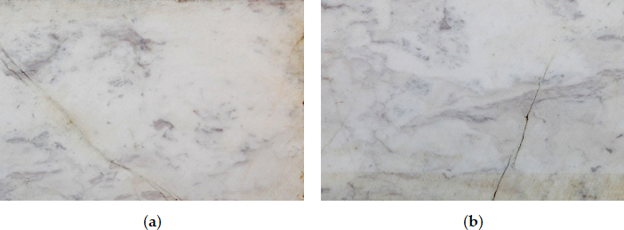

# Marble Crack Segmentation (MCS) Dataset
Marble is a metamorphic, i.e., heated and compressed, rock originating from sedi-mentary limestone. Marble is quarried naturally and contains mainly calcium. In some cases, magnesium can prevail, and then the rock is called dolomite [29]. Marble is quarried in blocks of 3×2×5 meters. From these blocks, slabs are cut, usually in the size of 3×2 me-ters and thickness ranging from 2-4 cm. Slabs are further cut into tiles in various sizes, depending on the needs of the construction. 

The detection of flaws using computer vision is a difficult task due to the complex textures on many marble types marketed today. It is very common to encounter Type I cracks that were filled naturally with minerals. These types of filled cracks are called fis-sures and don’t create problems on the stability of the slab (as seen in the figure below). Due to their optical similarity to cracks, fissures pose a significant problem to the automatic recognition of cracks.

<p align="center">
    
</p>


# Dataset Properties

* Total samples: 246
* Number of classes: 2 (0: background, 1: crack)
* Image format: jpg/png
* Image size: 256xx256

## Structure
```
.
├── dataset
    ├── images
      ├── _0_0_20210531_17292.jpg
      ├── _0_0_20210531_17293.jpg
      ...
    ├── masks
      ├── _0_0_20210531_17292.png
      ├── _0_0_20210531_17293.png
      ...
```
Each image's corresponding mask has the same name (but with a png extention).

# Acknowledgements

We built upon the original dataset, called [Marble Surface Anomaly Detection - 2](www.google.com) and uploaded by Aman Rastogi to kaggle, by annotating the marbles with cracks for semantic segmenation.

# Citation
If you use the dataset in a scientific publication, please cite us using the following bibtex citation:
```
TODO (when published)
```

Also cite the original dataset, using the following bibtex:
```
@misc{rastogi-a,
  author = {Rastogi, A.kaggle},
  title = {Marble Surface Anomaly Detection - 2 Available online},
  url = {https://www.kaggle.com/datasets/wardaddy24/marble-surface-anomaly-detection-2},
  language = {en}
}
```

# License
Attribution 4.0 International
